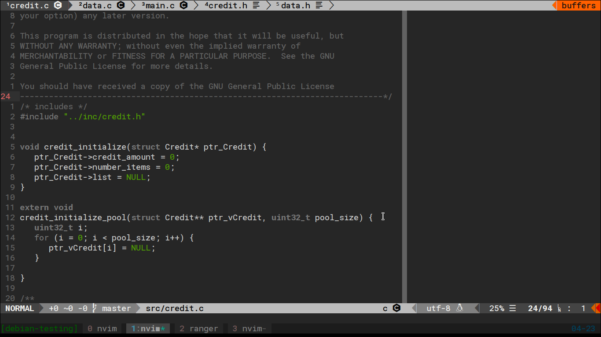

# Paramount-suizo
## Based in paramount colorscheme:


[original]: https://github.com/powickstrom/vim-colors-paramount

A minimal colorscheme for Vim that only puts emphasis on the paramount.

## Screenshots



## Installation

Simply copy the color scheme file to your `~/.vim/colors`
directory or use a plugin manager like [Plug][] or [Vundle][] and add
`"elsuizo/vim-colors-paramount-suizo"` as a plugin.

[vundle]: https://github.com/gmarik/Vundle.vim
[plug]: https://github.com/junegunn/vim-plug

## Usage

```
:colorscheme paramount-suizo
```

Supports both `background=light` and `background=dark`.

## Credits

Based on the [pencil][] and [off][] colorschemes.

[pencil]: https://github.com/reedes/vim-colors-pencil
[off]: https://github.com/reedes/vim-colors-off


Original license from pencil: [MIT](LICENSE)
